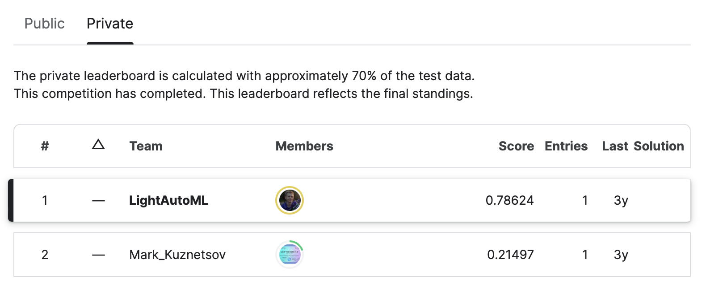

# AutoML на практике: сделать AI за 60 секунд

### QR код на этот репозиторий:

   

### Спикер - Рыжков Александр

   

- Окончил МГУ им. М.В.Ломоносова в 2015 году
- 3х Kaggle GrandMaster – в такой комбинации звание есть только у **5 человек в мире** 
- Руководитель команды LightAutoML

E-mail: alexmryzhkov@gmail.com

### Описание репозитория

В этом репозитории собраны примеры **быстрого решения Kaggle соревнований на основе библиотеки LightAutoML**:

- **Выживет ли пациент?** - [соревнование](https://www.kaggle.com/competitions/patient-survival-prediction), [решение](./code/lightautoml-patient-survival.ipynb), метрика ROC-AUC

   

- **Вернут ли кредит?** - [соревнование](https://www.kaggle.com/competitions/ds-masters-math-retake/overview), [решение](./code/lightautoml-dsmasters.ipynb), метрика Accuracy

   

- **Предсказание рейтинга фильма** - [соревнование](https://www.kaggle.com/competitions/tadmo-faru-pm/overview), [решение](./code/lightautoml-baseline-film-ratings.ipynb), метрика MAE

   

### Дополнительные материалы:
1) [LightAutoML Github](https://github.com/sb-ai-lab/LightAutoML)
2) [Телеграм канал с новостями LightAutoML](https://t.me/lightautoml)
3) [Чат в телеграм с практическими вопросами по LightAutoML](https://t.me/joinchat/sp8P7sdAqaU0YmRi)
4) [Обучающий курс по LightAutoML](https://developers.sber.ru/help/lightautoml)
5) [Документация](https://lightautoml.readthedocs.io/en/latest/)
6) [PyPI](https://pypi.org/project/lightautoml)
7) [Официальный сайт LightAutoML](https://developers.sber.ru/portal/products/lightautoml)

------------
# AutoML in practice: how to make AI in 60 seconds

### Speaker - Ryzhkov Alexander

   

- Graduated from Lomonosov Moscow State University in 2015
- 3х Kaggle GrandMaster – only 5 people in the world have such combination
- Head of LightAutoML group

E-mail: alexmryzhkov@gmail.com

### Repository contents

This repository contains **fast LightAutoML solutions for Kaggle competitions** :

- **Patient survival** - [competition](https://www.kaggle.com/competitions/patient-survival-prediction), [solution](./code/lightautoml-patient-survival.ipynb), ROC-AUC metric

   

- **Credit default** - [competition](https://www.kaggle.com/competitions/ds-masters-math-retake/overview), [solution](./code/lightautoml-dsmasters.ipynb), Accuracy metric

   

- **Film rating prediction** - [competition](https://www.kaggle.com/competitions/tadmo-faru-pm/overview), [solution](./code/lightautoml-baseline-film-ratings.ipynb), MAE metric

   

### Additional materials:
1) [LightAutoML Github](https://github.com/sb-ai-lab/LightAutoML)
2) [Telegram channel with LightAutoML news](https://t.me/lightautoml)
3) [Telegram chat with LightAutoML practical questions](https://t.me/joinchat/sp8P7sdAqaU0YmRi)
4) [LightAutoML 101 course](https://developers.sber.ru/help/lightautoml)
5) [Documentation](https://lightautoml.readthedocs.io/en/latest/)
6) [PyPI](https://pypi.org/project/lightautoml)
7) [LightAutoML official site](https://developers.sber.ru/portal/products/lightautoml)